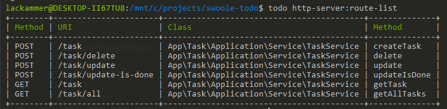
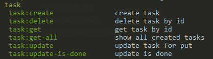

# TODO Http Server Swoole

This application allows you to run an HTTP server using Swoole with TODO services.
It also gives you the option to call these services via CLI if you don’t have a frontend, so you can still use the program without a UI.
<br>
This is a single-user application with no authentication and, due to the lack of pagination, it is limited to 50 tasks.

### Install
To install, follow these steps:
```shell
git clone https://github.com/robert-knepper/swoole-todo.git
cd swoole-todo
sudo php install-todo.php
```
From now on, you can access the CLI like this:
```shell
todo list
```

### Run all Tests
```shell
vendor/bin/phpunit
```

### Code Coverage
install xdebug
```shell
sudo apt install php-xdebug
php -m | grep xdebug
```

Generate code coverage:
```shell
XDEBUG_MODE=coverage vendor/bin/phpunit --coverage-text
```

## Using the Application

Before starting, configure the log file paths, connection settings, and server startup information in the .env file.
Then start the server with:

```shell
todo http-server:start-server
```

To see a list of registered routes:
```shell
todo http-server:route-list
```


You can either use these services directly or run the CLI commands:



# Project Details
## Application Life Cycle:
- To see the life cycle, check `bin/entry-point.php`.
-  Command life cycle is in `artisan`.
- In general:
  1) The app loads the list of providers from `src/Shared/App/config.php`.
  2) First, it calls the register method of each provider, then the boot method.
  3) If running from the console, it executes your command — all dependencies are loaded before the application starts running.

## Used Architecture:
This project uses a mix of Hexagonal Architecture and Modular Monolith, with MVC/MVP concepts in the Application layer.

This keeps the structure clean, testable, and extendable.

Because this is PHP, Laravel-style naming was used (`ServiceProvider`, `artisan`, `command`, `container`) to make onboarding easier for PHP developers.

Another reason for using this architecture was to gain more hands-on experience with it, as this is an educational project.

### Architecture Details:
1) Hexagonal Architecture (Ports & Adapters)

    - Modules are split into Domain / Application / Infrastructure layers.

    - Dependencies point inward; Domain is independent.

    - Adapters connect to databases or external services.

2) Modular Monolith

   - Each module (e.g., Task) is almost independent and can later be extracted as a service.

   - Each has its own Provider, Support, and Helper.

   - Internal module-to-module communication instead of fully centralized MVC.

3) MVC Similarities

   - Controller/Command in Application layer works like MVC’s Controller.

   - Domain is equivalent to MVC’s Model.

   - API JSON responses serve as “Views.”

4) MVP Similarities

   - Service/Application Layer is like a Presenter, preparing data from Domain for output.

   - Domain Model is the Model.

   - API endpoint/Command is the View layer for input/output.
### Not Fully Implemented Architecture

The Hexagonal Architecture is not fully implemented — some layers like database mappers were skipped for simplicity.
Modules tied to business logic live in the root `src` folder.
Shared utility modules live in `Shared`.

### Explanation of Each Module’s Folders:
- `Infrastructure` – External-facing code: service providers, port implementations, repositories.

- `Infrastructure/Bootstrap` – Module’s service provider.

- `Infrastructure/Adapter` – Port interface implementations from Application/Port.

- `Domain` – Data models (like Laravel’s Models).

- `Application` – Main business logic.

- `Application/Command` – CLI commands for the module.

- `Application/Service` – Controllers (Laravel MVC equivalent).

- `Application/Port` – Interfaces that define what’s exposed externally.

- `Application/Validation` – Input request validation.

- `Support` – Helper functions.

- `Lib` – Custom libraries for the module.

## Development Guidelines:
- Never use `env()` directly in business logic — only in module `config.php`.

- Put all helper functions, routes, and command bindings in the module’s service provider.

- Use `storage_path` helper for file storage.

- Write tests for every service in `tests/ModuleName`.

- All service actions in `Application/Service` must return a `DefaultResponseDTO` (never a raw array).

## Conventions Not Followed:
- CLI commands (like those in Task module) skip strict error handling, clean code, and performance optimizations since they are only for end-user interaction.

- Redis repository implementation is functional but not fully optimized (e.g., no hashes for updates, no counters for tasks).

- REST conventions (e.g., DELETE, PUT/PATCH) were ignored to save development time.

- Request validation happens inside controllers instead of in a separate validation layer.

- `env` library was used instead of a custom loader for simplicity.

- Minimal commenting — code is self-descriptive except for critical methods.

- Standardized `DefaultResponseDTO` for maintainability, even at the cost of small performance hits.

## Designing patterns used:
### Strategy Pattern
- `Shared/Log/Infrastructure/Bootstrap/LogServiceProvider.php`

- `Shared/Task/Infrastructure/Bootstrap/TaskServiceProvider.php` (in `registerService`)

Used to swap between Redis and in-memory storage for tests.

### Repository Pattern
- `InMemoryTaskRepositoryAdapter`
- `RedisTaskRepositoryAdapter`

Separates business logic from data access; enables DB switching without touching the Domain.

### Singleton Pattern
- `Shared/App/Lib/App.php`

Keeps Swoole server stateful and reduces resource usage by reusing objects.

### Factory Pattern
- Shared/App/Lib/App.php

Acts as an IoC container, centralizing object creation and enabling DI.

### Dependency Injection
- `Shared/Log/Infrastructure/Bootstrap/LogServiceProvider.php`
- `Shared/Task/Infrastructure/Bootstrap/TaskServiceProvider.php`

Improves flexibility and testability by decoupling dependencies.

## Steps To Develop a New Module:
1) Create a folder with the module name in `src` or `Shared`.

2) Add a ServiceProvider in `Infrastructure/Bootstrap`.

3) Register it in `src/Shared/App/config.php` under `providers`.

4) Start coding.

5) Services in `Application/Service` must return `DefaultResponseDTO`.

6) Add routes in the ServiceProvider with
   ````
   $this->container->getRouter()->add('POST', '/task', [TaskService::class, 'createTask']);
   ````

7) Optionally create CLI commands in `Application/Command`.

8) Write tests in `tests/YourModule`.

7) حالا از این به بعد شما در سرور خود به این روت دسترسی دارید، می تونید براش کامند هم تعریف کنید در مسیر Task/Application/Command می تونید کامند های مشابه رو ببینید
8) در مسیر tests/Task تست هارو ببینید و مشابه اون ها برای ماژول خود تست بنویسید
